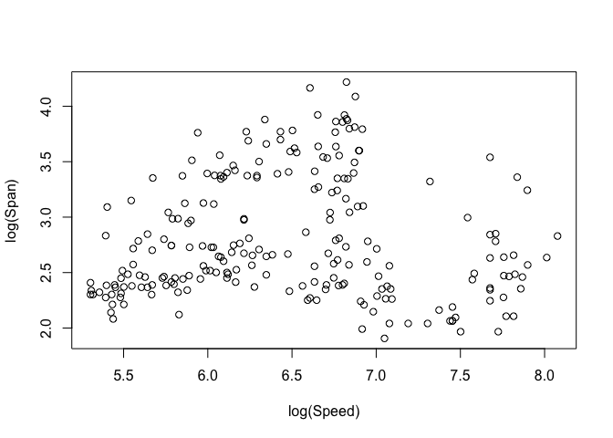

<!-- README.md is generated from README.Rmd. Please edit that file -->

# eccficm: Expected Conditional Characteristic Function-based Independence Criterion measures

<!-- badges: start -->

<!-- badges: end -->

The goal of `eccficm` is to provide new distance correlation/covariance
type of measures for testing independence between two random vectors
using the expected conditional characteristic function-based
independence criterion (ECCFIC) method developed by @yin2019new and
@ke2019expected. The method is nonparametric, can detect both linear and
nonlinear dependencies, and overcomes many challenges/limitations of
independence measures.

## Installation

You can install the released version of `eccficm` from
[CRAN](https://CRAN.R-project.org) with:

``` r
install.packages("eccficm")
```

## Available Functions

The main functions are `ecd`, `eccfic`, `ecd.test`, and `eccfic.test` as
described below.

  - `ecd`, `eccfic`: compute the covariance and correlation type
    statistics.

  - `ecd.test`, `eccfic.test`: perform a permutation test of
    independence based on the ECD and ECCFIC correlation and covariance
    type statistics, respectively.

  - `generateData`: generates optional data for feature screening based
    on some specific models.

  - `fscreen`: Performs the sure independence feature screening using
    correlation learning between each predictor and the response.

## Example

In the examples that follow, we use the aircraft data available in the
`sm` package in R. The data contains six characteristics of aircraft
designs in the twentieth century. We consider two variables, wing span
(m) and maximum speed (km/h) in period 3 with 230 observations. Our goal
is to test the independence of log(Span) and log(Speed) using ECCFIC
correlations as test statistics. Results based on distance correlation
is included for comparison. \(999\) replicates are used for the
permutation test.

We first load the `sm` package to get access to the `aircraft` data and
filter the `aircraft` data to obtain data for just the third brand time
period.

``` r
library(sm)
#> Package 'sm', version 2.2-5.6: type help(sm) for summary information

# get the aircraft data
data("aircraft", package = "sm")

# get data for the third brand time period
aircraft <- aircraft[aircraft$Period==3, ] 

attach(aircraft) # expose variable names to the R search path
```

Create a scatterplot to explore the relationship between `log(Speed)`
and `log(Span)`.

``` r
plot(log(Speed), log(Span))
```



The above graph suggests the existence of some sort of association
between `Speed` and `Span` which appears to be nonlinear. In the
subsequent codes we will use the hypothesis testing functions in the
`eccficm` package as well as one from the `energy` package to determine
if there is enough evidence to conclude on the observed relationship.

Here, we load our software package `eccficm`.

``` r
library(eccficm)
```

First, we test the independence of `log(Speed)` and `log(Span)` with the
`ecd.test` function. We use 10 slices for the slicing estimation, ECD
correlation as test statistic, and perform 999 permutations.

``` r
ecd.test(log(Speed), log(Span), est="slice", ns=10, ts="ecdcor",  B=999)
#> 
#>  ecdCor permutation test of independence - Estimation Method: Slicing
#> 
#> data:  X - log(Speed) , Y - log(Span) , Replicates 999
#> ecdCor = 0.32865, p-value = 0.001
#> alternative hypothesis: X is not independent of Y
#> sample estimates:
#>    ecdCor    ecdCov ecdVar(X) 
#> 0.3286453 0.2950304 0.8977167
```

Using the ECD correlation as test statistic, we obtain a p-value of
**0.001**.

Similarly, we use the `eccfic.test` function with 10 slices for its
slicing estimation, ECCFIC correlation as test statistic, and 999 total
permutations. The p-value for this test is also **0.001**.

``` r
eccfic.test(log(Speed), log(Span), est="slice", ns=10, ts="eccficcor",  B=999)
#> 
#>  eccficCor permutation test of independence - Estimation Method:
#>  Slicing on Y
#> 
#> data:  X - log(Speed) , Y - log(Span) , Replicates =  999
#> eccficCor = 0.15382, p-value = 0.001
#> alternative hypothesis: X is not independent of Y
#> sample estimates:
#>     eccfic  eccficCor 
#> 0.08586636 0.15382091
```

Finally, we compare the results for our independence measures with that
of the distance correlation with the same number of permutations. The DC
independence testing function is avaialble in the `energy` package.
Interestingly, using DC as test statistic produces the same p-value of
**0.001**.

``` r
energy::dcor.test(log(Speed), log(Span), R=999)
#> 
#>  dCor independence test (permutation test)
#> 
#> data:  index 1, replicates 999
#> dCor = 0.28045, p-value = 0.001
#> sample estimates:
#>      dCov      dCor   dVar(X)   dVar(Y) 
#> 0.1218536 0.2804530 0.4872107 0.3874712
```

From the above outputs, despite the nonlinear relation between wing span
and maximum speed, the `ecd.test`, `eccfic.test`, and `dcor.test`
functions returned a very small p-value of 0.001 suggesting that there
is enough evidence to conclude that wing span depends on maximum speed.
This shows how sensitive distance correlation and ECCFIC correlations
are to nonlinear associations. Moreover, we see how comparable our
measures are to the distance correlation.
