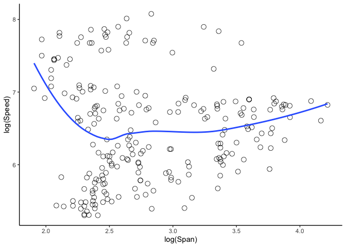

<!-- README.md is generated from README.Rmd. Please edit that file -->

***NOTE: The package is not yet officially available for public use.
Please do respect our wish by not installing the package until this note
is removed. Thank you\!***

# eccficm: Expected Conditional Characteristic Function-based Independence Criterion Measures

<!-- badges: start -->

<!-- badges: end -->

The goal of `eccficm` is to provide new distance correlation/covariance
type of measures for testing independence between two random vectors
using the expected conditional characteristic function-based
independence criterion (ECCFIC) method developed by Yin and Yuan
([2019](#ref-yin2019new)) and Ke and Yin ([2019](#ref-ke2019expected)).
The method is nonparametric, can detect both linear and nonlinear
dependencies, and overcomes many challenges/limitations of independence
measures.

Although the package is based on both ECD measures (Yin and Yuan
[2019](#ref-yin2019new)) and ECCFIC measures (Ke and Yin
[2019](#ref-ke2019expected)), we chose to use only ECCFIC in the name of
the package because ECD belongs to the family of generalized ECCFIC
measures. However, to preserve the unique implementations of the
different methods from the two papers (Yin and Yuan
[2019](#ref-yin2019new); Ke and Yin [2019](#ref-ke2019expected)),
different R functions are separately created and made available for the
ECD measures as well as the ECCFIC measures. As a result, R functions
based on ECD are either named “ecd” or prefixed by “ecd”, with the
ECCFIC related R functions also named in a similar fashion.

## Installation

Once the package becomes officially available, the following two options
will be available for installation.

### Installing development version

You can install the development version of regexcite from
[GitHub](https://github.com/) with:

``` r
# install.packages("devtools")
devtools::install_github("williamagyapong/eccficm")
```

### Installing released version

You can install the released version of `eccficm` from
[CRAN](https://CRAN.R-project.org) with:

``` r
install.packages("eccficm")
```

## Available Functions

The main functions are `ecd`, `eccfic`, `ecd.test`, and `eccfic.test` as
described below.

  - `ecd`, `eccfic`: compute the covariance and correlation type
    statistics.

  - `ecd.test`, `eccfic.test`: perform a permutation test of
    independence based on the ECD and ECCFIC correlation and covariance
    type statistics, respectively.

  - `generateData`: generates optional data for feature screening based
    on some specific models.

  - `fscreen`: Performs the sure independence feature screening using
    correlation learning between each predictor and the response.

> Although the slicing method for `ECD` and `ECCFIC` is not very
> sensitive to the number of slices (ns), it is suggested that the
> number of data points in each slice should exceed *5* but not close to
> *n/2*, where *n* is the sample size.

## Examples

### Aircraft data: Speed versus Span

In this example, we use the aircraft data available in the `sm` package
in R. The data contains six characteristics of aircraft designs in the
twentieth century. We consider two variables, wing span (m) and maximum
speed (km/h) in period 3 with 230 observations. Our goal is to test the
independence of log(Span) and log(Speed) using ECCFIC correlations as
test statistics. Results based on Pearson’s product-moment correlatoin
and distance correlation are included for comparison. *999* replicates
are used for the permutation test.

We first load the `sm` package to get access to the `aircraft` data and
filter the `aircraft` data to obtain data for just the third brand time
period.

``` r
library(sm)

# get the aircraft data
data("aircraft", package = "sm")

# get data for the third brand time period
aircraft_p3 <- aircraft[aircraft$Period==3, ] 

attach(aircraft_p3) # expose variable names to the R search path
```

#### Scatter plot of log(Span) against log(Speed)

Create a scatter plot to explore the relationship between `log(Speed)`
and `log(Span)`.

``` r
library(ggplot2)

ggplot(aircraft_p3, aes(log(Span), log(Speed))) +
  geom_point(alpha = 0.8, size=3, shape=1) +
  geom_smooth(method = "loess", se=F) +
  theme_classic()
```



``` r

# plot(log(Speed), log(Span))
```

The above graph suggests the existence of some sort of association
between `Speed` and `Span` which appears to be nonlinear. In the
subsequent codes we will use the hypothesis testing functions in the
`eccficm` package as well as one from the `energy` and `stats` packages
to determine if there is enough evidence to conclude on the observed
relationship.

At this point we load our software package `eccficm`.

``` r
library(eccficm)
```

#### ECD and ECCFIC association statistics

Let’s first take a look at the `eccfic` statistics.

``` r
# compute ecd statistics
ecd(log(Speed), log(Span), ns=10)
#> $ecdCov
#> [1] 0.2950304
#> 
#> $ecdCor
#> [1] 0.3286453
#> 
#> $ecdVarX
#> [1] 0.8977167

# compute eccfic statistics
eccfic(log(Speed), log(Span), est = 'slice', ns=10)
#> $eccfic
#> [1] 0.08586636
#> 
#> $eccficCor
#> [1] 0.1538209
```

#### Hypothesis Test of Independence

> The alternative hypothesis of interest is that `log(Speed)` is a
> function of `log(Span)`. In other words, we want to test whether the
> `log(Speed)` depends on `log(Span)`.

We first test the independence of `log(Speed)` and `log(Span)` with the
`ecd.test` function. We use 10 slices for the slicing estimation, ECD
correlation as test statistic, and perform 999 permutations.

``` r
ecd.test(log(Speed), log(Span), est="slice", ns=10, ts="ecdcor",  B=999)
#> 
#>  ecdCor permutation test of independence - Estimation Method: Slicing
#> 
#> data:  X -> log(Speed) , Y -> log(Span) , Replicates = 999
#> ecdCor = 0.32865, p-value = 0.001
#> alternative hypothesis: X is not independent of Y
#> sample estimates:
#>    ecdCor    ecdCov ecdVar(X) 
#> 0.3286453 0.2950304 0.8977167
```

Using the ECD correlation as test statistic, we obtain a p-value of
**0.001**.

Similarly, we use the `eccfic.test` function with 10 slices for its
slicing estimation, ECCFIC correlation as test statistic, and 999 total
permutations. The p-value for this test is also **0.001**.

``` r
eccfic.test(log(Speed), log(Span), est="slice", ns=10, ts="eccficcor",  B=999)
#> 
#>  eccficCor permutation test of independence - Estimation Method:
#>  Slicing on Y
#> 
#> data:  X -> log(Speed) , Y -> log(Span) , Replicates = 999
#> eccficCor = 0.15382, p-value = 0.001
#> alternative hypothesis: X is not independent of Y
#> sample estimates:
#>     eccfic  eccficCor 
#> 0.08586636 0.15382091
```

Finally, we compare the results for our independence measures with that
of the distance correlation with the same number of permutations as well
as the Pearson’s product-moment correlation. The DC independence testing
function is available in the `energy` package. Interestingly, using DC
as test statistic produces the same p-value of `0.001`. However, the
p-value associated with the test based on Pearson’s correlation is
`0.8001`.

``` r
# Distance correlation as test statistic
energy::dcor.test(log(Speed), log(Span), R=999)
#> 
#>  dCor independence test (permutation test)
#> 
#> data:  index 1, replicates 999
#> dCor = 0.28045, p-value = 0.001
#> sample estimates:
#>      dCov      dCor   dVar(X)   dVar(Y) 
#> 0.1218536 0.2804530 0.4872107 0.3874712

# Pearson's product-moment as test statistic
stats::cor.test(log(Speed), log(Span))
#> 
#>  Pearson's product-moment correlation
#> 
#> data:  log(Speed) and log(Span)
#> t = 0.25349, df = 228, p-value = 0.8001
#> alternative hypothesis: true correlation is not equal to 0
#> 95 percent confidence interval:
#>  -0.1128179  0.1458274
#> sample estimates:
#>        cor 
#> 0.01678556
```

> From the above outputs of test results, despite the nonlinear relation
> between wing span and maximum speed, the `ecd.test`, `eccfic.test` and
> `dcor.test` functions returned a very small p-value of `0.001`,
> suggesting that maximum speed of the aircraft depends on its wing
> span. This shows how sensitive distance correlation and ECCFIC
> correlations are to nonlinear associations. On the other hand, the
> Pearson’s correlation test suggested no evidence of association,
> showing how Pearson’s correlation cannot detect non-linear
> associations if one truly exists. Moreover, we see how comparable our
> measures are to the distance correlation.

# References

<div id="refs" class="references">

<div id="ref-ke2019expected">

Ke, Chenlu, and Xiangrong Yin. 2019. “Expected Conditional
Characteristic Function-Based Measures for Testing Independence.”
*Journal of the American Statistical Association*.
<https://doi.org/10.1080/01621459.2019.1604364>.

</div>

<div id="ref-yin2019new">

Yin, Xiangrong, and Qingcong Yuan. 2019. “A New Class of Measures for
Testing Independence.” *Statistica Sinica*.
<http://www3.stat.sinica.edu.tw/ss_newpaper/SS-2017-0538_na.pdf>.

</div>

</div>
